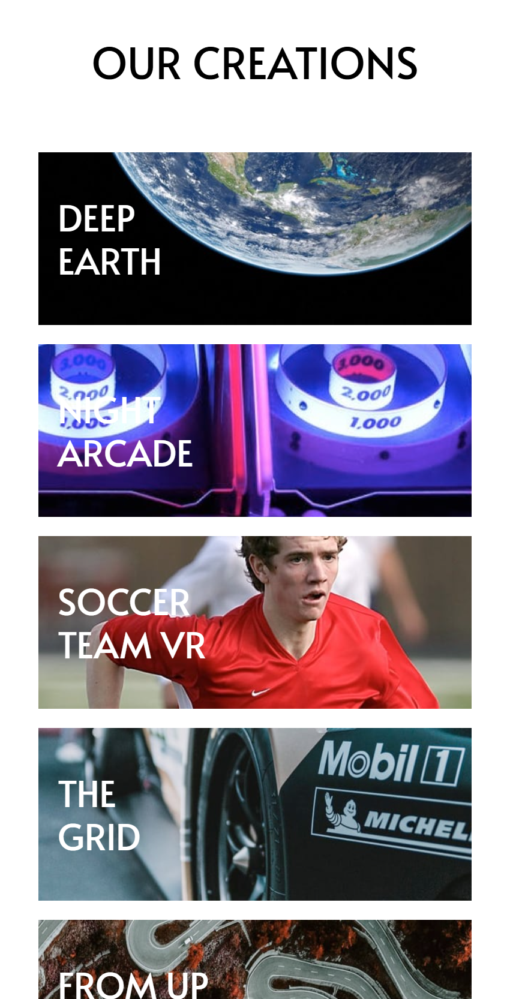

# Frontend Mentor - Loopstudios Landing Page

This is my solution to the [Loopstudios landing page challenge on Frontend Mentor](https://www.frontendmentor.io/challenges/loopstudios-landing-page-N88J5Onjw).

## Table of Contents

- [Overview](#overview)
  - [The Challenge](#the-challenge)
  - [My Solution](#my-solution)
    - [Desktop](#desktop)
    - [Mobile](#mobile)
  - [Links](#links)
- [My Process](#my-process)
  - [Built With](#built-with)
  - [Continued Development](#continued-development)
  - [Useful Resources](#useful-resources)
- [Author](#author)

## Overview

### The Challenge

Users should be able to:

- View the optimal layout for the site depending on their device's screen size
- See hover states for all interactive elements on the page

### My Solution

#### Desktop

##### Section 1

##### Section 2

##### Section 3

##### Footer

#### Mobile

##### Section 1

##### Mobile Menu

##### Section 2

##### Section 3

##### Footer

### Links

- 🔗 [Live Site](https://loopstudioscaminaur.netlify.app/)
- 🗂️ [View Code on GitHub](https://github.com/Caminaur/Loopstudios-landing-page)

## My Process

### Built With

- Semantic HTML5
- CSS custom properties
- Mobile-first responsive design
- [React](https://reactjs.org/)
- [Tailwind CSS](https://tailwindcss.com/)

### Continued Development

I'm currently working on improving my frontend skills and exploring what's possible with React. I'm focusing on learning how to build interactive user interfaces, and gaining a better understanding of component-based architecture.

### Useful Resources

- [Tailwind UI documentation](https://tailwindcss.com/docs) – For understanding utility-first design patterns
- [React Docs](https://reactjs.org/docs/getting-started.html) – For clarifying state and component logic

## Author

- 🔗 [Personal Website](https://julian-caminaur.tech/)
- 💼 [Frontend Mentor Profile](https://www.frontendmentor.io/profile/Caminaur)
- 🎯 [CSS Battle](https://cssbattle.dev/player/caminaur)
- 🧠 [Exercism](https://exercism.org/profiles/Caminaur)
